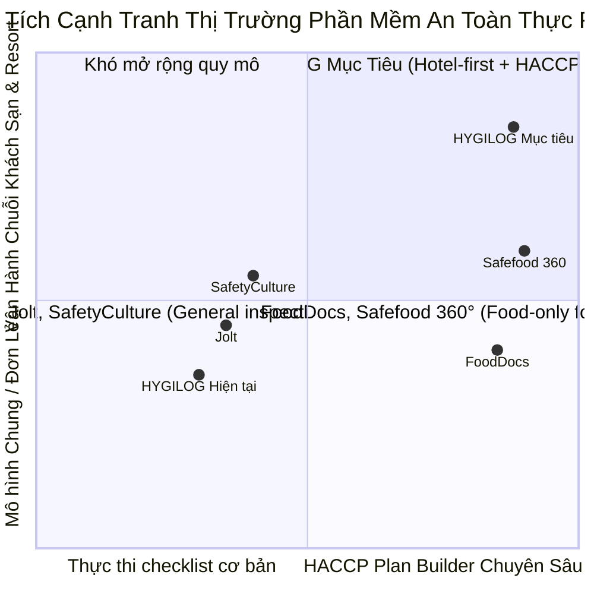
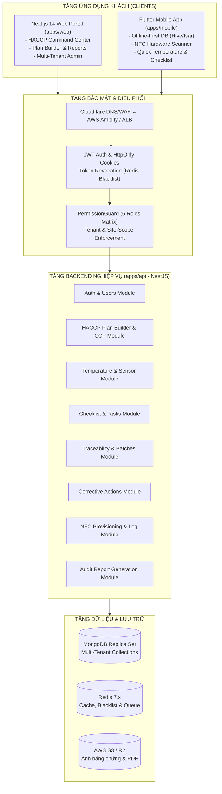

# 📋 KẾ HOẠCH NÂNG CẤP TOÀN DIỆN HỆ THỐNG HYGILOG (PLANUPDATE.md)

> **Dự án**: HYGILOG — Hospitality SaaS Platform for HACCP Compliance  
> **Phiên bản kế hoạch**: v2.0 (Cập nhật ngày 25/09/2026)  
> **Mục tiêu chiến lược**: Vượt qua trạng thái Prototype/Alpha, khôi phục đường chạy Web ↔ API ↔ Database, đóng kín toàn bộ lỗ hổng bảo mật RBAC & Tenant Isolation, khởi tạo module Flutter Mobile trong Monorepo và trang bị bộ công cụ HACCP Plan Builder cạnh tranh trực diện với FoodDocs.

---

## 🧭 MỤC LỤC

1. [TỔNG QUAN HIỆN TRẠNG & PHÂN TÍCH RỦI RO CỐT LÕI](#1-tổng-quan-hiện-trạng--phân-tích-rủi-ro-cốt-lõi)
2. [CHIẾN LƯỢC ĐỊNH VỊ SẢN PHẨM & LỢI THẾ CẠNH TRANH](#2-chiến-lược-định-vị-sản-phẩm--lợi-thế-cạnh-tranh)
3. [KIẾN TRÚC MỤC TIÊU (TARGET ARCHITECTURE)](#3-kiến-trúc-mục-tiêu-target-architecture)
4. [LỘ TRÌNH THỰC THI 4 GIAI ĐOẠN (ROADMAP)](#4-lộ-trình-thực-thi-4-giai-đoạn-roadmap)
   - [Giai đoạn 1: Nền tảng Kỹ thuật & Kết nối Trọn vẹn Web ↔ API ↔ Database](#giai-đoạn-1-nền-tảng-kỹ-thuật--kết-nối-trọn-vẹn-web--api--database)
   - [Giai đoạn 2: Siết Chặt Bảo Mật, RBAC Thực & Tenant Isolation](#giai-đoạn-2-siết-chặt-bảo-mật-rbac-thực--tenant-isolation)
   - [Giai đoạn 3: Khởi Tạo Ứng Dụng Flutter Mobile & Quét NFC Thực Địa](#giai-đoạn-3-khởi-tạo-ứng-dụng-flutter-mobile--quét-nfc-thực-địa)
   - [Giai đoạn 4: HACCP Plan Builder & Phân Tích Mối Nguy (Cạnh tranh FoodDocs)](#giai-đoạn-4-haccp-plan-builder--phân-tích-mối-nguy-cạnh-tranh-fooddocs)
5. [TIÊU CHUẨN HOÀN THÀNH (DEFINITION OF DONE - DOD)](#5-tiêu-chuẩn-hoàn-thành-definition-of-done---dod)
6. [KẾ HOẠCH QUẢN TRỊ RỦI RO & DỰ PHÒNG](#6-kế-hoạch-quản-trị-rủi-ro--dự-phòng)

---

## 1. TỔNG QUAN HIỆN TRẠNG & PHÂN TÍCH RỦI RO CỐT LÕI

Theo báo cáo kiểm định kỹ thuật ngày 25/09/2026 (`UPDATE.MD`), hệ thống đang ở mức trưởng thành kỹ thuật khoảng **1.6/5**:

| Hạng mục | Hiện trạng | Rủi ro chính |
| :--- | :--- | :--- |
| **Giao diện Web (`apps/web`)** | Đã hoàn thiện toàn bộ 11 màn hình nghiệp vụ, 17 routes biên dịch tĩnh đạt 100%, cookie auth được đồng bộ. | Chưa kết nối luồng dữ liệu thật từ Backend API; còn sử dụng mock data. |
| **Backend API (`apps/api`)** | File `main.ts` đang rỗng (0 bytes). Trình biên dịch báo 128 lỗi TypeScript. Thiếu entrypoint khởi động NestJS. | Không có máy chủ API hoạt động để cung cấp dữ liệu cho Web và Mobile. |
| **Bảo mật & RBAC** | 10 Controller dùng Guard giả (empty class). JWT fallback hardcode secret. Redis blacklist token chưa hoạt động. | Lỗ hổng nghiêm trọng: endpoint có thể bị bypass xác thực và phân quyền. |
| **Tenant Isolation** | Đã lọc theo `organizationId` ở tầng Service nhưng thiếu kiểm soát scope theo `siteIds`. Thiếu test cách ly 2 tenant. | Nguy cơ rò rỉ dữ liệu giữa các khách sạn/chi nhánh (Cross-tenant leak). |
| **Mobile Application** | Chưa có source code Flutter trong monorepo. | Chưa hiện thực hóa được trải nghiệm thao tác tại hiện trường và quét NFC. |
| **Tính năng HACCP** | Mới dừng lại ở ghi log nhiệt độ và checklist đơn giản. Thiếu trình tạo kế hoạch HACCP tự động. | Khoảng cách tính năng lớn so với FoodDocs và Safefood 360°. |

---

## 2. CHIẾN LƯỢC ĐỊNH VỊ SẢN PHẨM & LỢI THẾ CẠNH TRANH

Nhằm cạnh tranh trực diện với các giải pháp hàng đầu thị trường (FoodDocs, SafetyCulture, Jolt):



### 3 Trụ Cột Khác Biệt Hóa Của HYGILOG:
1. **Trình tạo Kế hoạch HACCP Kỹ Thuật Số Tự Động (Digital HACCP Plan Builder)**:
   * Cho phép doanh nghiệp F&B / Khách sạn tạo toàn bộ hồ sơ HACCP (Mối nguy sinh học, hóa học, vật lý; điểm CCP; giới hạn tới hạn; thủ tục giám sát; hành động khắc phục) chỉ trong 30 phút thay vì thuê tư vấn mất nhiều tuần.
2. **Khách Sạn & Chuỗi F&B Cao Cấp (Hotel-First Hospitality OS)**:
   * Không chỉ quản lý bếp ăn độc lập mà tích hợp quản trị phân quyền đa cơ sở (Multi-site, Bếp trung tâm, Nhà hàng fine dining, Quầy bánh, Bar lounge, Tiệc hội nghị Banquet).
3. **Hiện Trường Thực Tế Với Chip NFC (NFC Field Proof)**:
   * Chống gian lận ghi chép từ xa bằng việc bắt buộc chạm thẻ chip NFC gắn tại thiết bị/khu vực kiểm soát.

---

## 3. KIẾN TRÚC MỤC TIÊU (TARGET ARCHITECTURE)



---

## 4. LỘ TRÌNH THỰC THI 4 GIAI ĐOẠN (ROADMAP)

### Giai đoạn 1: Nền tảng Kỹ thuật & Kết nối Trọn vẹn Web ↔ API ↔ Database
> **Mục tiêu**: Xóa bỏ trạng thái lỗi biên dịch, khởi động máy chủ API NestJS hoàn chỉnh, kết nối với MongoDB/Redis cục bộ qua Docker, nạp dữ liệu mẫu (Seed Data) và chuyển đổi Frontend từ mock data sang gọi API thực.

#### Các nhiệm vụ chi tiết:
1. **Khôi phục Entrypoint API (`apps/api/src/main.ts`)**:
   * Khởi tạo NestFactory với `AppModule`.
   * Cấu hình toàn cục: `ValidationPipe` (whitelist, transform, forbidNonWhitelisted), `HttpExceptionFilter`, `LoggingInterceptor`.
   * Cấu hình CORS an toàn theo biến môi trường `CORS_ORIGINS`.
   * Tích hợp Swagger / OpenAPI tài liệu hóa API tại `/api/docs`.
   * Lắng nghe cổng cấu hình (mặc định: `3001`).
2. **Sửa dứt điểm 128 lỗi TypeScript trong `apps/api`**:
   * Chuẩn hóa khai báo DTO, Schemas Mongoose và Service Methods.
   * Đồng bộ kiểu dữ liệu với package `@hygilog/shared-types`.
   * Đảm bảo lệnh `npm run build --workspace=api` thoát với exit code 0.
3. **Kích hoạt Cơ sở Dữ liệu Cục bộ (Docker Compose) & Seed Script**:
   * Khởi chạy MongoDB (`localhost:27017`) và Redis (`localhost:6379`) qua Docker Compose.
   * Chạy script `infrastructure/scripts/seed.ts` để nạp dữ liệu mẫu ban đầu:
     * 1 Organization chuẩn (*Tập Đoàn Ẩm Thực HYGILOG Hospitality*).
     * 3 Chi nhánh (*Landmark 81, Quận 1 Đồng Khởi, Tây Hồ Hà Nội*).
     * 6 Tài khoản người dùng mẫu tương ứng 6 vai trò.
     * Danh mục thiết bị lạnh, nguyên liệu lô hàng, mẫu checklist và sự cố CAPA.
4. **Kết nối Web Frontend (`apps/web`) với Backend API Thực tế**:
   * Cấu hình `NEXT_PUBLIC_API_URL=http://localhost:3001/api`.
   * Thay thế dữ liệu mock tĩnh tại các trang bằng các lời gọi Axios từ `apps/web/lib/api.ts`:
     * Đăng nhập thực tế nhận JWT Access Token & Refresh Token.
     * API Nhiệt độ (`GET /api/temperature`, `POST /api/temperature`).
     * API Checklist (`GET /api/checklists`, `POST /api/checklists`).
     * API Truy xuất Lô hàng (`GET /api/traceability/batches`, `POST /api/traceability/batches`).
     * API Sự cố CAPA (`GET /api/corrective-actions`, `POST /api/corrective-actions`).
     * API Thẻ NFC (`GET /api/nfc/tags`, `POST /api/nfc/scans`).
     * API Chi nhánh & Nhân sự (`GET /api/sites`, `GET /api/users`).

---

### Giai đoạn 2: Siết Chặt Bảo Mật, RBAC Thực & Tenant Isolation
> **Mục tiêu**: Loại bỏ toàn bộ Guard rỗng/giả, cài đặt cơ chế RBAC và Tenant Isolation chuẩn mực, chống rò rỉ dữ liệu giữa các tổ chức và chi nhánh, viết bộ kiểm thử E2E bảo mật.

#### Các nhiệm vụ chi tiết:
1. **Triển khai Bộ Bảo Vệ Thật (`AuthGuard` & `PermissionGuard`)**:
   * Xóa bỏ class mock rỗng tại 10 Controller. Thay thế bằng `@UseGuards(JwtAuthGuard, PermissionGuard)`.
   * Decorator `@RequirePermissions(PERMISSIONS.xxx)` ghi metadata chính xác vào `Reflector`.
   * Loại bỏ hoàn toàn fallback JWT secret dạng plain text trong mã nguồn; bắt buộc đọc từ biến môi trường có độ dài bảo mật tối thiểu 32 ký tự.
2. **Quản Lý Token & Đăng Xuất An Toàn Với Redis Blacklist**:
   * Kích hoạt `RedisService` thật để lưu blacklist JTI (JWT ID) khi người dùng bấm Đăng xuất.
   * Xử lý refresh token rotation chống tấn công đánh cắp token.
3. **Thắt Chặt Cơ Chế Cô Lập Dữ Liệu Đa Khách Thuê (Tenant & Site Isolation)**:
   * **Nguyên tắc vàng**: Backend là nguồn chân lý (Source of Truth). Tuyệt đối không nhận `organizationId` từ Request Body do Client gửi lên.
   * Lấy `organizationId` trực tiếp từ `request.user` đã được JWT Strategy giải mã và xác thực.
   * Áp dụng Site-scope Guard cho các vai trò cấp cơ sở (`site_manager`, `kitchen_staff`), ngăn chặn người dùng cơ sở A truy cập hoặc sửa đổi dữ liệu cơ sở B.
4. **Viết Bộ Kiểm Thử Tự Động (E2E Security & RBAC Tests)**:
   * Khởi chạy Jest E2E test suite trong `apps/api/test`:
     * `auth.e2e-spec.ts`: Kiểm tra 401 khi không có token, token hết hạn, token bị thu hồi.
     * `rbac.e2e-spec.ts`: Kiểm tra 403 khi role không đủ quyền thực hiện hành động.
     * `tenant-isolation.e2e-spec.ts`: Tạo 2 Organization độc lập A và B; chứng minh Tenant A không thể đọc/ghi dữ liệu của Tenant B.

---

### Giai đoạn 3: Khởi Tạo Ứng Dụng Flutter Mobile & Quét NFC Thực Địa
> **Mục tiêu**: Xây dựng module ứng dụng di động `apps/mobile` ngay bên trong Monorepo, cung cấp công cụ làm việc thực địa cho nhân viên bếp và giám sát ATTP, tích hợp quét NFC và kiến trúc lưu trữ ngoại tuyến (Offline-First).

#### Các nhiệm vụ chi tiết:
1. **Khởi Tạo Cấu Trúc Dự Án Flutter (`apps/mobile`)**:
   * Thiết lập dự án Flutter 3.x với kiến trúc phân lớp sạch sẽ (Clean Architecture / BLoC hoặc Riverpod).
   * Cấu hình quản lý môi trường (`dev`, `staging`, `prod`).
2. **Cơ Chế Lưu Trữ Ngoại Tuyến (Offline-First Architecture)**:
   * Tích hợp cơ sở dữ liệu cục bộ tốc độ cao (`Hive` hoặc `Isar DB`) trên thiết bị.
   * Luồng đồng bộ hóa thông minh (Background Sync Queue):
     * Khi nhân viên đo nhiệt độ trong kho đông lạnh mất sóng Wi-Fi/4G, dữ liệu tự động lưu vào hàng đợi cục bộ.
     * Khi thiết bị có kết nối trở lại, service tự động đẩy bản ghi lên máy chủ và xử lý giải quyết xung đột (Conflict Resolution - Last-Write-Wins hoặc Server-Validation).
3. **Tích Hợp Phần Cứng Quét Thẻ Chip NFC**:
   * Sử dụng thư viện `flutter_nfc_kit` hỗ trợ cả iOS (CoreNFC) và Android (NFC Adapter).
   * Quy trình quét hiện trường:
     * Chạm thẻ NFC → Đọc UID chip bảo mật → Xác thực đúng vị trí trạm kiểm soát → Tự động mở form đo nhiệt độ hoặc checklist tương ứng.
     * Kèm theo chữ ký thời gian (Timestamp) và tọa độ địa lý GPS nhằm triệt tiêu hoàn toàn rủi ro khai khống dữ liệu an toàn thực phẩm.

---

### Giai đoạn 4: HACCP Plan Builder & Phân Tích Mối Nguy (Cạnh tranh FoodDocs)
> **Mục tiêu**: Xây dựng tính năng chiến lược giúp HYGILOG vượt trội trên thị trường: Bộ công cụ tạo Kế hoạch HACCP tự động kỹ thuật số (Digital HACCP Plan Builder), tự động hóa phân tích mối nguy và xác định điểm CCP theo chuẩn Codex Alimentarius.

#### Các nhiệm vụ chi tiết:
1. **Trình Tạo Sơ Đồ Quy Trình Chế Biến Thực Phẩm (Food Process Flowchart Builder)**:
   * Giao diện trực quan cho phép Bếp trưởng / Chuyên viên QA lựa chọn loại hình kinh doanh (Nhà hàng Á, Âu, Bếp bánh, Buffet, Tiệc cưới, Bar pha chế).
   * Lập sơ đồ các công đoạn: Tiếp nhận nguyên liệu → Bảo quản lạnh/đông → Sơ chế → Nấu chín nhiệt độ cao → Làm nguội nhanh → Giữ nóng phục vụ → Xử lý thức ăn thừa & Lưu mẫu.
2. **Bộ Máy Phân Tích Mối Nguy Tự Động (Automated Hazard Analysis Engine)**:
   * Thư viện cơ sở dữ liệu tích hợp sẵn hàng trăm mối nguy chuẩn quốc tế:
     * *Mối nguy sinh học (Biological)*: Salmonella, E. coli, Listeria monocytogenes, Norovirus,...
     * *Mối nguy hóa học (Chemical)*: Dư lượng thuốc BVTV, hàn the, chất tẩy rửa clo,...
     * *Mối nguy vật lý (Physical)*: Mảnh kim loại, thủy tinh vỡ, tóc, côn trùng,...
     * *Chất gây dị ứng (Allergens)*: Gluten, hải sản có vỏ, đậu phộng, trứng, sữa,...
   * Tự động áp dụng Cây Quyết Định HACCP (HACCP Decision Tree) 4 câu hỏi để xác định công đoạn nào là **CCP (Critical Control Point)** hoặc **PRP (Pre-requisite Program)**.
3. **Tự Động Xuất Hồ Sơ Thẩm Định & Xuất Bản Kế Hoạch HACCP**:
   * Tự động sinh bảng Kế hoạch Kiểm Soát HACCP tổng thể gồm: Điểm CCP, Mối nguy cần kiểm soát, Giới hạn tới hạn (Critical Limit), Quy trình giám sát, Tần suất kiểm tra, Hành động khắc phục (CAPA) và Hồ sơ lưu trữ.
   * Tính năng xuất hồ sơ pháp lý 1-click thành bộ tài liệu PDF chính thức phục vụ kiểm tra của Cục An Toàn Thực Phẩm và chứng nhận ISO 22000.

---

## 5. TIÊU CHUẨN HOÀN THÀNH (DEFINITION OF DONE - DOD)

Một giai đoạn chỉ được nghiệm thu khi đáp ứng đầy đủ các tiêu chuẩn khắt khe sau:

```
[MÃ NGUỒN HOÀN CHỈNH]
  ├── Mã nguồn không chứa comment TODO hoặc code giả dạng placeholder.
  ├── Không có hardcoded secrets / token / credentials.
  └── Kiểu dữ liệu TypeScript strict mode (0 lỗi linter/compiler).

[KIỂM THỬ & CHỨNG THỰC]
  ├── Unit Test đạt độ bao phủ tối thiểu > 80% logic nghiệp vụ.
  ├── 100% E2E Security Tests (401, 403, Multi-Tenant) vượt qua thành công.
  └── Đường chạy Web ↔ API ↔ Database hoạt động thông suốt với dữ liệu thật.

[TÀI LIỆU & BÀN GIAO]
  ├── Cập nhật tài liệu kỹ thuật tương ứng trong thư mục /docs.
  ├── Nhật ký thay đổi (CHANGELOG.md) ghi nhận đầy đủ phiên bản.
  └── Git commit chuẩn Conventional Commits (feat, fix, docs, test).
```

---

## 6. KẾ HOẠCH QUẢN TRỊ RỦI RO & DỰ PHÒNG

| Rủi ro kỹ thuật / Nghiệp vụ | Mức độ | Biện pháp giảm thiểu & Kế hoạch dự phòng |
| :--- | :---: | :--- |
| **Xung đột phiên bản phụ thuộc giữa Web, API và Shared-types** | Trung bình | Khóa cứng `package-lock.json`, sử dụng NPM Workspaces thống nhất, build `packages/shared-types` trước khi build ứng dụng. |
| **Docker môi trường dev không tương thích trên Windows** | Thấp | Cung cấp tài liệu cấu hình rõ ràng cho Docker Desktop (WSL 2 backend) và fallback kịch bản kết nối MongoDB Atlas / Redis Cloud qua biến môi trường. |
| **Mất kết nối Internet tại bếp nhà hàng khi dùng Mobile** | Cao | Thiết kế cơ chế Offline-First với hàng đợi đồng bộ tự động (Background Sync Queue) và lưu trữ cục bộ mã hóa an toàn. |
| **Rủi ro rò rỉ dữ liệu giữa các cơ sở / khách sạn đối thủ** | Cực cao | Kiểm soát phân quyền ở tầng cơ sở dữ liệu (Database Query Filtering) thông qua Request Scoping Interceptor; cấm dựa vào lọc ở tầng giao diện người dùng. |

---

*Kế hoạch này được phê duyệt làm kim chỉ nam thực thi cho toàn bộ đội ngũ kỹ thuật và AI Agents trong việc hiện thực hóa mục tiêu sản phẩm HYGILOG.*
